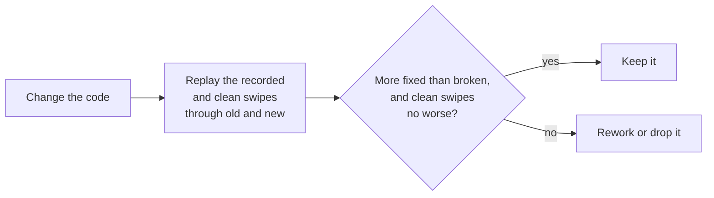
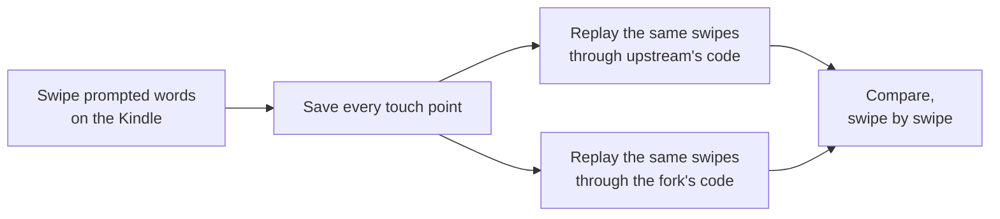

# Developing Ligature

The code layout, the tools for recording and replaying swipes, and how
the accuracy numbers in the [README](../README.md#accuracy) were
measured.

## Code layout

The plugin's Lua files are grouped by what they do. `modules.lua` lists
where each one lives, and the plugin, tests and tools all load them by
name through it.

| Folder | What's in it |
|---|---|
| `koreader/` | Hooks into KOReader's keyboard and touch handling |
| `input/` | Turning touches and key presses into typed text |
| `recognition/` | Finding the words a swipe or tapped letters could be |
| `learning/` | The words and word pairs you keep, and where your thumb lands |
| `dictionary/` | Reading, installing and managing word lists, and the offensive-word lists |
| `ui/` | Drawing the suggestion row, the swipe trail, the one-handed keyboard's handle menu and resize frame, and the gesture reference page |
| `icons/` | The icons in the one-handed handle menu and resize frame |
| `images/` | The gesture reference page, made from screenshots of the keyboard at a Kindle Paperwhite's settings |
| `dictionaries/` | The bundled English word lists and word-pair table |
| `catalog.json` | A copy of the dictionary catalog, for choosing languages offline |

## Tests and tools

None of this is in the plugin folder or changes the plugin.

- `luajit spec/run.lua` runs the tests.
- `tools/swipe_session.py` runs a prompted swipe session on a device over
  SSH, then replays it.
- `tools/replay.lua` replays recorded sessions through the plugin code.
  `--compare DIR` shows which swipes a change fixed or broke.
- `tools/clean_swipes.lua` generates clean swipes for regression checks.
- `tools/fit_weights.lua` fits the ranking weights to recorded swipes.
- `tools/build_word_pairs.py` builds a dictionary's word-pair table.
- `tools/fetch_dictionary_sources.py` and `tools/build_dictionary.py`
  download the Leipzig word counts and build a dictionary package from
  them.
- `tools/build_offensive_lists.py` builds the offensive-word lists.

`swipe_session.py` installs a temporary KOReader patch that shows words,
sentences or search-style queries to swipe and records every attempt: the
touch points, the keys, what was typed, and whether you kept it, picked
another suggestion or deleted it. It prints each result as you go. At the
end it removes the patch, copies the recording to `sessions/` and replays
it. Learning is paused while a session is recorded, so the test doesn't
change your word counts.

`replay.lua` prints first choice, suggestions and mean reciprocal rank,
split by word length, by where the swipe started and by full-width or
one-handed, next to what the device showed at the time, plus the time
each swipe took. `--compare` lists every swipe that changed between two
plugin folders, with a McNemar p value. `--context`, `--usage` and
`--touch` learn word pairs, word counts and where the thumb lands as the
swipes are replayed, `--per-session` starts pairs and counts over for each
session, `--losses` shows at which step each missed word was lost, and
`--no-shape` leaves out the shape channel.

Recordings go in `sessions/`, which is git-ignored because it contains
typed text.

### Technical details

`fit_weights.lua` treats each recorded swipe as a choice between the
candidate words, with the chance of each word falling off exponentially
with its rank score (a conditional logit model). It finds the weights that
make the intended words most likely with Newton's method, reports standard
errors, and checks the fit by leaving each session out in turn and scoring
it with weights fitted on the others.

`clean_swipes.lua` builds a swipe for a word by moving in a straight line
between its key centres, pausing briefly on each, using the key positions
from a recorded session so they match a real device.

`build_word_pairs.py` reads sentence files (plain text, or Tatoeba's TSV
exports, compressed or not), counts pairs as described under
[Learning](how-it-works.md#learning), and
writes `words.pairs.tsv`, `words.pairs.idx` and their checksums into the
dictionary's manifest. `--exclude` and `--exclude-words 4` leave out any
sentence sharing four words in a row with the test prompts.

## Measuring accuracy

- 1,965 swipes over 23 sessions, recorded on a Kindle Paperwhite (12th
  gen) with KOReader v2026.07.2 using `tools/swipe_session.py`: 1,409
  words in short everyday sentences (11 sessions), 313 random words from
  three frequency bands (8 sessions) and 243 words of search-style queries
  (4 sessions). 1,019 were typed full width and 946 one-handed.
- `tools/replay.lua` feeds the recorded touch points back through each
  version's recognition code, so both versions see exactly the same
  swipes. It learns as the keyboard does. Word pairs and word counts start
  over for each session, as on a fresh install, and where your thumb lands
  carries over, as it would for one person's hand.
- The clean swipes are generated: a straight line between key centres
  with a short pause on each key, 1,500 words from each frequency band.
  They catch changes that break words which used to work.
- The ranking weights were fitted on the first six random-word sessions,
  and later constants were chosen by replaying the recordings, so the
  numbers lean optimistic. The query sessions were recorded after most of
  that tuning: the keyboard got 58% first choice on the device then,
  against 60% in replay now.
- Swipes that upstream cut short when a second finger touched the screen
  don't show up here, because the recordings were made with that fix in.
  Before the fix, it cut short 7 of 32 swipes in one session.
- "Fixed" and "broken" counts come with an exact McNemar test. Both
  differences in the README are far beyond chance (p below 1e-17).
- Timings are the mean over the same two full-width sentence sessions,
  with KOReader's own LuaJIT on the Kindle, each version in its own
  process, three runs each. They include reading word lists from storage
  the first time they're needed.

### Technical details

The recorder stores the raw touch events, not what the keyboard made of
them, together with the key rectangles on screen at the time. Replay
rebuilds the keyboard layout from those rectangles and drives the gesture
code with the recorded events, so any version of the recognition code can
be run on the same swipes. Each attempt also records what happened next:
kept, picked from the row, or deleted. Replay uses that to learn what the
device would have learned.

The McNemar test only looks at the swipes where the two versions disagree.
If a change made no difference, each of those would be a coin toss between
fixed and broken, and p is the chance of a split at least as uneven as the
one seen. 252 fixed against 6 broken has p around 2e-66.
