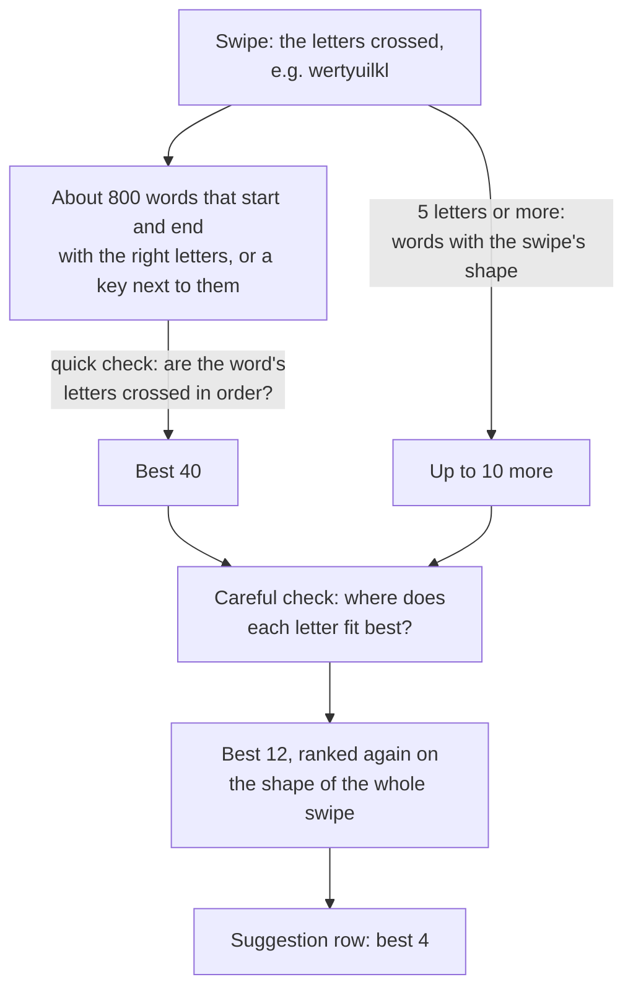
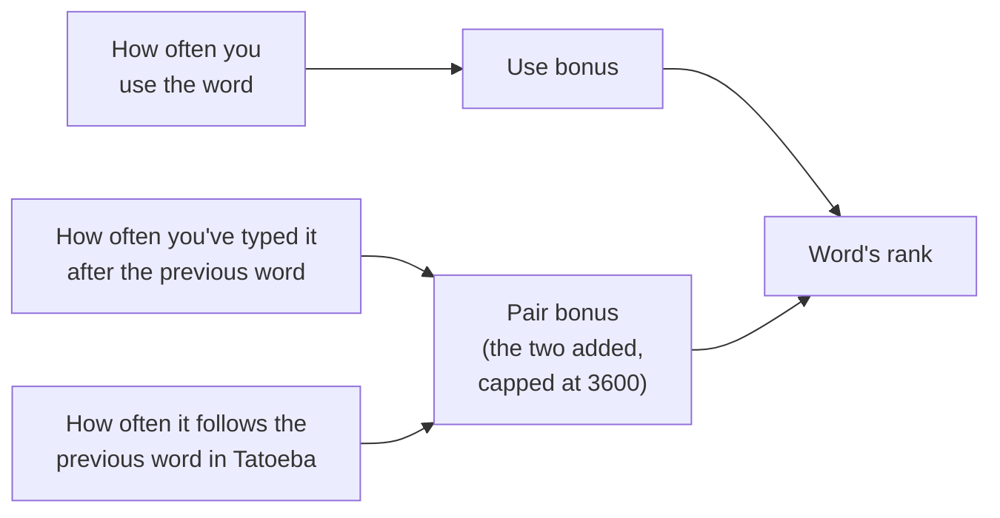
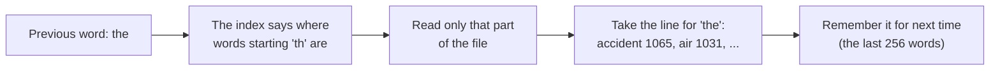
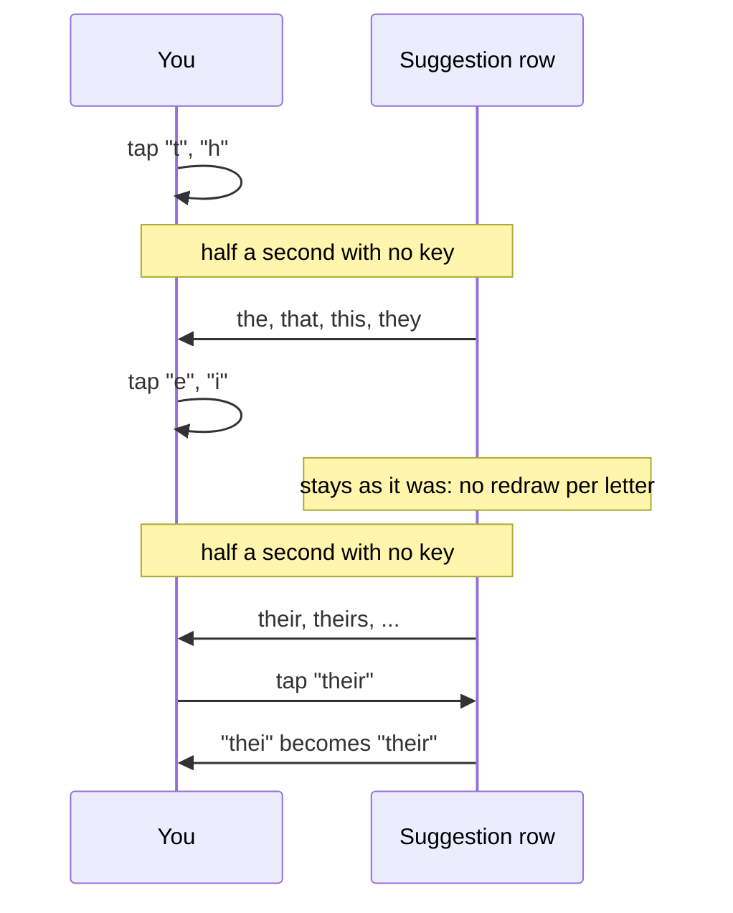

# How Ligature works

Each part starts with what Ligature does differently from upstream
[Tapless](https://github.com/azac/tapless.koplugin), then how it works and
the numbers behind it. The [README](../README.md) has the gestures and
settings.

[Recognition](#recognition) · [Learning](#learning) · [Typing](#typing) ·
[Swipe trail](#swipe-trail) · [Suggestion row](#suggestion-row) ·
[Dictionaries](#dictionaries)

## Recognition

- Long words are found by the shape of the whole swipe, even when the
  path skips some of their letters.
- Swipes that start just inside the next key over still find the word.
- A corner you cut short can lend a letter from the key next to it.
- Scribbling back and forth on a key types a double letter.
- Rare short fragments like "bq" and "gtg" stop beating real words.
- Common words count for more against the shape of the swipe.
- Swear words and slurs are ranked down, so they stop taking the place of
  the word you meant.
- Spellings that only repeat letters ("wee", "weee") no longer fill the
  row.
- Swipes that start on the number row type a word, not a digit.
- Contractions come out with their apostrophes: "dont" types "don't".

Every swipe gives a string of letters the finger passed over, such as
`wertyuilkl` for "well". Candidate words are looked up in the dictionary
by first and last letter, scored on how well their letters line up with
that string and with the actual touch points, then ranked with word
frequency.

A finger flattens a long word, so its swipe often misses letters the
word needs, or starts or lifts on a key next to its first or last
letter. On any swipe that crosses five letters or more,
the keyboard also looks for words whose path has about the same length and
shape as the swipe and whose ends lie near the swipe's ends. Those words
join the others, letters the path never crossed cost a little, and the
shape of the whole swipe counts for more in the final ranking.

On e-ink it's easy to land just inside a neighbouring key. If the swipe
starts within a quarter of a key of another key, words starting with that
key are looked up too. They pay a small penalty, much smaller than a word
whose first letter the swipe missed completely.

A fast swipe often cuts a corner, so the key at the corner is never
touched. A word can take up to two of its inner letters from a key next to
one the path passed over. This only counts where the path actually turned,
so keys you slide straight past don't lend letters. Each borrowed letter
costs a little.

A swipe can't show a doubled letter, so "too" and "to" look the same. A
short back-and-forth on one key counts as a repeated letter and favours the
doubled spelling. Small wobbles and sharp corners don't count.

Dictionaries are full of short rare strings (bq, chg, gtg) that fit almost
any short swipe. Words of four letters or fewer that are rare pay a
penalty, based only on length and frequency, so it works the same in every
language. A word you use often is exempt (see [Learning](#learning)).

The balance between swipe shape and word frequency was fitted to the
recorded swipes by maximum likelihood, then pulled back towards the old
values so rare words didn't lose too much.

Offensive words are ranked as if they were much rarer. They aren't hidden:
the lists are written for filtering chat, and hold words with innocent uses
a reader may want. A listed word still comes first when the swipe fits it
clearly best, and once you've kept it twice it's ranked like any other
word. Tapping a word out letter by letter types it as always. The lists
cover 26 languages and come from the
[List of Dirty, Naughty, Obscene and Otherwise Bad Words](https://github.com/LDNOOBW/List-of-Dirty-Naughty-Obscene-and-Otherwise-Bad-Words)
(CC BY 4.0). On the recorded one-handed sessions, listed words showed up in
the suggestion row 2 times, where there had been 18.

Words that differ only in doubled letters ("we", "wee") look the same to a
swipe. At most two of them take a place in the suggestion row, and
spellings with a letter three times in a row are left out.

The keyboard has a row of digits above the letters. A swipe that starts
on a digit and goes on across letters is taken as starting on the letter
key below. A tap, or a short slide that doesn't reach another letter, is
left to KOReader, so digits and the characters you get by sliding off a
digit key still work.

The English word list had no words with an apostrophe, so swiping "don't"
typed "dont". There's no apostrophe key to swipe over, so a contraction is
found by its letters and typed with its apostrophe: "dont" gives "don't",
"theyre" gives "they're", "im" gives "I'm". Where the letters are a word of
their own too, both stay: "were" and "we're", "well" and "we'll", "its"
and "it's". Which one comes first depends on how common each is and the
word before it.

### Technical details

Each step looks at fewer words, more carefully:



#### Letters and how much each one counts

As the finger moves, every new key it enters adds a letter. Each letter
then gets an intent weight between 0.15 and 1, for how likely it is that
the finger was aiming for that key and not passing over it on the way:

```
intent = 0.15 + 0.45 × closeness + 0.30 × turn + 0.10 × dwell

closeness  1 at the key centre, 0 at 0.65 of a key away
turn       how sharply the path turned at its closest point, 0 to 1
dwell      time on the key compared with the average key, 0 to 1
```

The first and last letters always count at least 0.9. Skipping a letter
with a low weight, a key the finger only brushed on the way, costs little.

#### Finding candidate words

The dictionary is split into word lists by first and last letter, so
"well" is in the `wl` list. A swipe reads the list for its own first and
last letters, plus the lists for up to two keys next to where it ended and
up to two keys next to where it started, when it started within a quarter
of a key of them. Only words no longer than the swipe's letter string are
scored here. The shape channel below finds longer ones.

#### Quick pass

Each word's letters are matched in order against the swipe's letters,
taking the first place each letter can go. That gives a path cost:

```
path cost = weight of the swipe letters the word skips
          + twice the weight of any skipped before its first letter
            or after its last
          + 6    if the first letter isn't the key the swipe started on
            (1 instead, if it's the neighbouring key the swipe started in)
          + 4    if the last letter isn't the key the swipe ended on
            (2 if it's taken from a key next to the end point)
          + 0.5  per letter borrowed from a neighbouring key (at most 2)
          + up to 4 for how far the touch points were from the key centres
```

A key can only lend its neighbours a letter where the path turned by at
least 0.3 radians there. Neighbours are keys whose centres are within 1.2
key sizes. An edit-distance check (up to two edits) and a special case for
short words can lower the cost for near misses.

#### Shape channel

On a swipe crossing 5 letters or more, words of 3 letters or more are
looked at when their first and last keys lie within one key of the
swipe's ends and their ideal path is 0.7 to 1.4 times as long as the
swipe. They're ranked by `6000 × shape distance − frequency`, and the best
10 join the careful check. There, a letter of the word the path never
crossed costs 2, in the units of a skipped swipe letter.

#### Ranking

Everything is put on one scale, where lower is better:

```
rank = 949 × path cost
     − frequency                         (Zipf × 1000: "the" is 7730)
     + 3122 if the word has 4 letters or fewer, is rarer than Zipf 3
            and you've used it fewer than 4 times
     + 3500 if the word is on the offensive list
            and you've kept it fewer than 2 times
     − word pair bonus                   (see Learning)
     − 3354 × scribble confidence for each doubled letter
     − your own use bonus                (see Learning)
```

The path cost weight (949), the rare-word cost, the scribble credit and
the path shape weight (3089, below) were fitted by maximum likelihood on
the recorded word sessions, using `tools/fit_weights.lua`, with
leave-one-session-out checks. The full fit made rare words lose too often
on the clean swipes, so the shipped path and shape weights sit halfway
between the old ones and the fitted ones, on a log scale.

#### Careful check

The best 40 are scored again with dynamic programming instead of the
first-fit match. The table has one row per letter of the word and one
column per swipe letter, and there are three copies of it, for 0, 1 or 2
borrowed letters. Each cell holds the cheapest way to match the word so
far: either skip a swipe letter, paying its intent weight, or match it,
paying the distance from that touch point to the key centre. So a letter
that appears twice in the swipe is matched where it fits best, which isn't
always where it comes first.

#### Path shape

The best 12 get a last check on the whole shape. The swipe and the ideal
path through the word's key centres are both resampled to 20 evenly spaced
points. The average distance between matching points, in key sizes, plus a
little for the difference in length, is multiplied by 3089 and added to
the rank. When the shape channel ran, it's multiplied by 6000 instead.

#### Scribbles

On each key, turns sharper than 45 degrees are added up. If they come to
at least 0.7 of a full circle and the path on that key is at least 0.65 of
a key long, the key gets a scribble confidence, which favours words with
that letter doubled.

#### The number row

The starting point is checked against the digit keys first. If it's on
one, the key in the row below at the same position is used as the start.
If the swipe then crosses fewer than two letters, it's handed back to
KOReader untouched.

#### Contractions

Every word list entry has two spellings: the letters it's matched on and
the word it types. `tools/add_contractions.py` adds 68 contractions from
`tools/contractions_en.tsv` under their letters, so `dont` types `don't`,
at wordfreq's frequency for the real spelling. The apostrophe-less
spelling is dropped unless it's a word of its own (were, well, its, ill,
id, hell, shell, shed, wed, lets, cant, wont).

## Learning

- Words you keep typing rise up the list.
- The word that usually follows the one before it wins ("the sun", not
  "the sin"). Each language learns its own word pairs.
- Words you tap out letter by letter count as well as swiped ones.
- The keyboard learns where your thumb lands and allows for it.

Learning is always on. Nothing is sent anywhere, and the counts are kept in
KOReader's settings.

Every word you keep in the text is counted. A word you pick from the
suggestion row counts double, and a word you delete straight away isn't
counted. From two uses a word gets a boost, which grows with use up to a
limit, and never lifts a word above the most common words. A word used four
times or more is also exempt from the rare short word penalty. Up to 2,000
words are kept, dropping the least used. On the recorded sentence sessions,
a learned word was put first 161 times when it was the right word, and 15
times when it wasn't.

A word you tap out and finish with a space or punctuation is counted once
and learned after the word before it, the same as a swiped word you keep.
Only dictionary and personal words count, so typos aren't learned. An
apostrophe is part of the word, so "don't" is learned whole, never "don" or
"t". A hyphenated word like "well-known" isn't learned at all.

Upstream Tapless already learned which word you type after which. Ligature
learns them separately for each language you type in. The fork also adds
a table of common word pairs for English, so this works from the first
sentence instead of only after you've typed a pair yourself. A pair's
bonus depends on how much likelier the word is after the previous word
than anywhere else. The learned bonus and the table bonus are added
together, up to the same limit the learned bonus had on its own. It only
applies when the previous word is followed by just a space, so after a
full stop or a comma nothing is assumed. When the table was added, it
fixed 18 sentence swipes and broke 1. The fixes were look-alike mistakes:
"tu" for "to", "will" for "well", "while" for "whole", "sin" for "sun".

The table is 1.8 MB and comes with the English dictionary. Only the part
for the previous word is read, when it's needed. It was counted from the
English sentences of [Tatoeba](https://tatoeba.org) (CC BY 2.0 FR) by
`tools/build_word_pairs.py`, leaving out any sentence that shares four
words in a row with the test prompts, so replays of the test sessions stay
fair. See `ligature.koplugin/dictionaries/en/ATTRIBUTION.txt`.

A thumb reaching across a one-handed keyboard tends to land short of the
keys further away, the same way each time. From the words you keep, the
keyboard learns how far your swipes land from the keys of the word, and
shifts later swipes back by that much before reading their keys. It keeps
a separate offset for the full-width keyboard and for each side of the
one-handed one, starts after 8 words, and never shifts by more than 0.4
of a key. Replaying every recorded session in order, it fixed 53
one-handed swipes and broke 15, and fixed 32 full-width swipes and broke
15.

### Technical details

What a word counts for:

| You... | Counts |
|---|---|
| swipe a word and leave it in the text | 1 |
| pick a word from the suggestion row | 2 |
| tap out a dictionary or personal word and end it with a space or punctuation | 1 |
| delete a swiped word straight away, or tap out a typo | 0 |

Each count is also learned after the word before it. Then:



Every bonus is in the same units as word frequency, Zipf × 1000, so 1000
is worth one step on a scale where "the" is about 7.7 and a rare word
about 2.

#### Use bonus

```
use bonus = 0                          under 2 uses
          = 500 × log2(uses)           capped at 2000
          but never lifting the word's frequency past 5500
```

| Uses | 1 | 2 | 4 | 8 | 16 or more |
|---|---|---|---|---|---|
| Bonus | 0 | 500 | 1000 | 1500 | 2000 |

The ceiling means a word you use a lot can catch up with common words, but
never beat "the" or "and" on frequency alone.

#### Learned pair bonus

For a pair you've typed `count` times: `600 × log2(count + 1)`, capped at
3600. The counts stop at 255. When a word has more than 24 followers, the
least used goes. When a language has more than 2,000 previous words, the
one followed least often goes. These caps are there because learned pairs are
saved in KOReader's settings file, which is rewritten in full on every
save.

#### Pair table bonus

Counted from 14.9 million words of Tatoeba sentences:

```
bonus = 1000 × log10( P(word | previous word) / P(word) )
```

That's the pointwise mutual information in frequency units: how much
likelier the word is right after the previous word than in general. It's
capped at 3000, and pairs seen fewer than 3 times or earning less than 300
are dropped. Each previous word keeps its 96 most frequent followers,
158,372 pairs in all. Contractions count as words, both before and after:
"i'm → afraid", "we → don't".

The table is stored like the dictionary: one text file, plus an index of
where each part starts.



Pairs are only counted across spaces, the way the keyboard sees the
previous word. So "Hello, world" has no pair, because the comma breaks it.

#### Where your thumb lands

Offsets are in key widths and heights, so they still hold after the
keyboard is resized. Each kept word gives the gap between where the swipe
started and ended and the word's first and last keys. A gap of more than
0.8 of a key is taken as a word changed afterwards and not learned. The
first 20 words are averaged. After that, each new word moves the offset by
5% of its gap. The shift is 1.25 times the learned offset, because the
words it learns from are the ones recognition chose, whose keys lie nearer
the finger than the words meant.

## Typing

- Pause while tapping out a word and the row offers words that finish it.
- Tap ⌫ right after a swipe and the whole word goes. Slide left from ⌫ to
  delete more words.
- A second finger touching the screen no longer cuts a swipe short.
- A swipe that only touches one letter types that letter.
- Fast tapping doesn't turn into swiped words.
- Spaces go in front of the next word, so punctuation sits right.

When you stop tapping for about half a second, the row shows up to four
words that start with what you've typed. They're ranked the same way as
swipes: how common the word is, whether it usually follows the word
before, and how often you use it. Tap one and it replaces what you typed,
keeps your capitals ("Th" gives "The"), and the next word gets its space
like after a swipe. The row isn't redrawn on every letter, only when you
pause, to keep e-ink refreshes down. If you carry on typing past what the
row was made for, a stale suggestion can't be picked by mistake. When
nothing matches, the row offers to add the word to your personal words.

The most common 256 words for each first letter are always searched. From
three letters in, if they don't fill the row, the rest of the dictionary
is searched too. Those word lists are read in the background while you
type the first letters, so typing never waits for the disk.

Typing the words from the earlier recorded sessions and pausing once,
after the second or third letter:

| | Sentences (553 words) | Random words (212) |
|---|---|---|
| Word in the suggestions after 2 letters | 70% | 17% |
| Word first in the suggestions after 2 letters | 49% | 4% |
| Word in the suggestions after 3 letters | 86% | 61% |
| Word first in the suggestions after 3 letters | 64% | 27% |

Picking the word at that one pause saves about a quarter of the
keystrokes in the sentences.

Tapping ⌫ straight after a swipe deletes the whole word, and the word
isn't learned. Sliding left from
⌫ deletes whole words: the first once you've slid 0.4 of a key, then one
more for each key width, up to 50, never past the start of the line. While
you slide, the words that will go are shown inverted, and lifting deletes
them.

A thumb resting on the edge of the screen mid-swipe used to be paired with
the swiping finger into a two-finger gesture, and the swipe ended part-way
through. It's now ignored until it lifts. This was the biggest single
cause of misses. Pinch zoom and two-finger typing are unchanged.

On KOReader v2026.07.2 and older, two fingers landing close together were
merged into one two-finger tap and both keys were lost. The fork backports
KOReader's fix (koreader#15840). Nothing is changed on newer KOReader.

On e-ink a tap often drifts far enough to count as a swipe, and the
keypress was lost. A swipe that only crosses one letter now types it, and
a short slide within half a second of tapping a letter types the key it
started on.

The space after a swiped word is added when the next word starts, so
"hello, world" comes out right and text doesn't end in a stray space. A
swiped word after a tapped word, or after punctuation, gets its space too.

Letter swipes keep working when another plugin or patch replaces the key
handlers, like the ZenOS keyboard patch.

### Technical details

#### Completions



Meanwhile, from the first letter, the word lists for words starting with
"t" are read in the background, a few milliseconds at a time.

Candidates come from the 256 most common words for the first letter, your
personal words, and, from three letters if those leave the row short,
every word list for that first letter that's already in memory. Each
candidate that starts with the typed letters (accents ignored) is scored:

```
score = frequency + pair bonus after the previous word + use bonus
        − 3500 if it's on the offensive list and you've kept it fewer than 2 times
```

The typed word itself, blocked words and spellings with a letter three
times in a row are left out, and the best four are shown. A pick only goes
through if the text box is the same one, the word at the cursor still
starts with the letters the row was made for, and the picked word still
starts with the word at the cursor. Otherwise the row is just cleared.

The previous word for completions is the last run of letters before the
word being typed, if only spaces separate them, the same way the keyboard
finds it for swipes. Input method layouts (Chinese, Japanese, Korean,
Vietnamese) get no completions, because their tapped letters are still
being composed.

#### Second finger

KOReader's gesture detector pairs a new touch with one already down, to
recognise pinches and two-finger taps. While a swipe is being drawn on the
keyboard, Ligature unpairs a new touch as it lands and parks it in a state
that ignores its events until it lifts.

#### Spaces

After a swiped or picked word, a space is waiting. What you do next
decides what happens to it:

| Next you... | The waiting space |
|---|---|
| swipe or type another word | goes in before it: "hello world" |
| type punctuation | isn't added, and keeps waiting: "hello, world" |
| type a space | is that space, so you don't get two |
| move the cursor or press backspace | is dropped |

A pending space remembers the text box and the cursor position. It's only
used if both are unchanged when the next word starts.

#### Fast tapping

A swipe that starts within 500 ms of a tapped letter and travels less than
0.6 of a key is typed as a tap on the key it started on.

## Swipe trail

- The trail is a thin grey line that follows your finger smoothly.
- It shows in night mode too.
- The faint ghosting it leaves is cleared with one flash when you pause.

The trail is drawn with a round brush about 0.75 mm wide, along curves
through the touch points that end at your finger, so it doesn't lag
behind. It inverts the pixels under it, which is why it shows light on
dark keys in night mode and needs nothing saved to clear it. Each new
piece is shown with e-ink's fast black-and-white update. That update can't
show grey, so half the pixels under the brush are inverted, in a
checkerboard fixed to the screen so overlapping pieces line up.

When you lift your finger, a quick refresh clears the trail. Fast updates
leave faint traces that build up over a long spell of typing, and only a
flashing refresh removes them. So after 8 swipes, once you stop swiping
for 3 seconds, the area those trails covered gets one flash. In the
recorded sessions only 9% of the pauses before the next word were longer
than 3 seconds, so it mostly comes at the end of a sentence.

## Suggestion row

- Hold a suggestion to block that word.
- The row clears its e-ink ghosting every few changes.
- All four slots are used for words. The language is shown on the space
  bar instead.
- The top suggestion is in bold.

Blocked words are listed under `Tools → Ligature → Manage dictionaries →
Blocked words` and can be unblocked there. Adding a word to your personal
words unblocks it. Blocking the word a swipe just typed replaces it with
the next suggestion.

Each slot is redrawn on its own, and only when its word changes, with a
fast partial e-ink update. Fast updates leave faint ghosts of earlier
words, so every sixth time the row changes, the whole row gets one flash
update. Blocked words are stored per language and skipped when words are
looked up, for swipes and completions alike.

## Dictionaries

Each dictionary is a folder with a manifest and its word lists, bundled in
the plugin (English only) or downloaded to KOReader's data folder. A
downloaded one with the same name takes over from the bundled one.
`catalog.json` in the plugin is a copy of the dictionaries repository's
catalog, used until the dictionary manager first downloads the current
one. Update it when a dictionary release changes the catalog. The
folders are only read again when one of them changes, since reading every
manifest is slow on an e-reader. Word lists are loaded when first needed
and kept in memory, about 30 MB for the whole of English at most.
Switching language frees the old language's lists.
